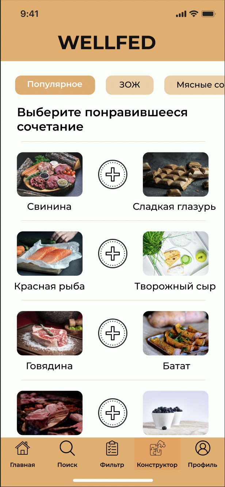

# Wellfed

## Описание проекта

Приложение Wellfed помогает пользователям найти нужный им кулинарный ре-
цепт, оно должно предложить пользователю множество функций поиска ре-
цептов. Также приложение должно обеспечить возможность создания инди-
видуального рецепта, учитывая предпочтения пользователя. Должны быть
реализованы функции расчёета калорий, функции, выявляющие в рецепте
аллергены.  
Основные пользователи приложения - люди, которые любят готовить или
хотят попробовать себя в чём-то новом. Домохозяйки, которые хотят разнообразить рацион питания семьи. Спортсмены и люди, ведущие здоровый образ
жизни. Люди, у которых есть аллергическая реакция на некоторые продукты
и которым тяжело найти рецепт. В целом приложение рассчитано на людей,
которые интересуются кулинарией.

## Состав проекта

Курсовая работа состоит из следующих ключевых пунктов:
- Требования к приложению;
- Диаграммы dfd, bpmn, idef0, idef3, диаграмма прецедентов, диаграмма активностей;
- Макет приложения в Figma.

## Дизайн приложения

Главная страница

Конструктор рецептов

Фильтрация рецептов

